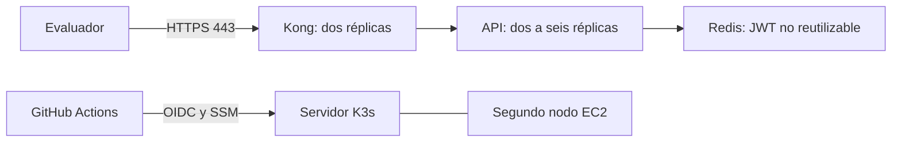

# AWS: evaluación temporal de tres días

La plantilla `infra/cloud/aws/template.json` crea dos EC2 t3.medium en zonas distintas, con Kubernetes K3s 1.34.12. Un nodo también aloja el plano de control. Kong y la API tienen réplicas en ambos nodos; Redis conserva los identificadores de transacción en un volumen local persistente. No es una arquitectura de producción con alta disponibilidad del plano de control o de Redis.



## Coste y eliminación

En Ohio, la estimación de dos instancias, dos IPv4 y 60 GiB gp3 es de unos 2,40 USD diarios antes de impuestos y consumos variables. No se crean EKS, NAT Gateway ni balanceadores administrados facturables. Los créditos de CPU están en modo estándar para evitar el suplemento de modo ilimitado.

La fecha `ExpiresUtc` debe quedar como máximo a 72 horas del inicio. EventBridge Scheduler termina ambas instancias a esa hora y los discos raíz se eliminan con ellas. Las IPv4 automáticas se liberan. Los datos de la evaluación se pierden: descarga previamente los resultados que quieras conservar. El presupuesto mensual de 10 USD permite seguimiento; **no constituye un tope de facturación**. La plantilla no envía correos ni contrata servicios de pago adicionales.

Después de la evaluación elimina también la pila y el parámetro privado de unión. No hay copias de seguridad ni snapshots automáticos. Si se elimina la pila antes del plazo, se eliminan sus dos servidores y la programación.

## Crear desde AWS CloudShell

Requiere una cuenta autorizada para crear EC2, IAM, SSM, Scheduler, presupuestos y CloudFormation. Usa una cuenta o entorno de evaluación sin un proveedor OIDC de GitHub ya existente; en caso contrario adapta la plantilla para reutilizarlo.

```sh
git clone https://github.com/jorgefprietol/devops-exercise.git
cd devops-exercise
python3 scripts/aws_template.py > infra/cloud/aws/template.json
aws cloudformation validate-template --template-body file://infra/cloud/aws/template.json
EXPIRA=$(date -u -d '+72 hours' +%Y-%m-%dT%H:%M:%S)
aws cloudformation create-stack --stack-name devops-evaluacion --region us-east-2 \
  --template-body file://infra/cloud/aws/template.json --capabilities CAPABILITY_IAM \
  --parameters ParameterKey=ExpiresUtc,ParameterValue="$EXPIRA"
aws cloudformation wait stack-create-complete --stack-name devops-evaluacion --region us-east-2
aws cloudformation describe-stacks --stack-name devops-evaluacion --region us-east-2 --query 'Stacks[0].Outputs'
```

Espera además a que ambos servidores aparezcan en Systems Manager y a que exista `/opt/devops/bootstrap-completo`. Las credenciales no están en UserData ni en GitHub: el token de unión se crea aleatoriamente y se guarda en Parameter Store SecureString. Las claves de la API se generan en el servidor, separadas por entorno y con permisos privados. La API Key fija corresponde al enunciado.

## HTTPS y primer despliegue

En una sesión de Systems Manager del servidor, usa su IP pública real. La emisión del certificado requiere aceptar las condiciones de Let's Encrypt. Se usa Certbot 5.4.0 y el perfil de seis días, suficiente para esta evaluación de tres días:

```sh
sudo /opt/devops/certbot/bin/certbot certonly --standalone --non-interactive \
  --agree-tos --register-unsafely-without-email --preferred-profile shortlived \
  --ip-address IP_PUBLICA
```

No desactives la comprobación TLS del cliente. El puerto 80 sirve únicamente para la validación del certificado. Si extiendes el plazo, implementa antes la renovación y la actualización del Secret TLS de cada entorno; esta guía no contempla una extensión automática.

El documento SSM que devuelve la pila recibe `Revision` (commit de 40 caracteres), `Image` (GHCR con digest SHA256) y `Environment`. Descarga esa revisión y ejecuta `scripts/aws_apply.py`: aplica manifiestos, espera las réplicas, comprueba HPA y prueba HTTPS, autenticación y reutilización de JWT. Production queda en `https://IP_PUBLICA/DevOps`; development y staging tienen servicios privados independientes.

## Conectar GitHub Actions

Configura las variables del repositorio con las salidas verificadas de la pila:

| Variable | Valor |
|---|---|
| `DEPLOY_TARGET` | `aws` |
| `AWS_DEPLOY_ROLE` | salida `RoleArn` |
| `AWS_DEPLOY_INSTANCE` | salida `ServerId` |
| `AWS_DEPLOY_DOCUMENT` | salida `DeployDocument` |

GitHub obtiene credenciales AWS de una hora mediante OIDC. El rol solo puede ejecutar el documento de despliegue en el servidor de esta pila y consultar el resultado. No se almacenan claves AWS permanentes. Master sigue desplegando production; develop, development; y las etiquetas, staging. El flujo conserva Build, Test, publicación inmutable y despliegue verificado. Para volver al laboratorio local cambia `DEPLOY_TARGET` a `local` y activa su agente.

## Entregar un JWT

Desde la revisión desplegada, genera el JWT en el servidor con `sudo python3 scripts/issue_jwt.py --secrets-file /opt/devops/private/production.env`. No entregues el secreto de firma. Cada envío válido requiere un JWT nuevo; repetir uno aceptado devuelve 409. Las credenciales locales y las de AWS son diferentes. Para Postman usa un entorno privado de AWS; cambiar solo `base_url` conservando el secreto local provoca 401. El JWT entregado caduca en cinco minutos; emite uno justo antes de la prueba del evaluador.

## Límites y seguridad

Los puertos 6443, 10250 y 8472 solo admiten tráfico entre nodos. SSH no está abierto. IMDSv2 es obligatorio y no se entrega el rol EC2 a los pods. El almacenamiento está cifrado; K3s cifra sus Secrets en reposo. NetworkPolicy restringe API y Redis. El HPA escala pods, no máquinas. El endpoint público utiliza el servidor de entrada; no se promete conmutación automática ante su pérdida. El segundo nodo cumple distribución y ejecución de réplicas, con el coste acotado de una demostración.

Fuentes: [requisitos K3s](https://docs.k3s.io/installation/requirements), [certificados IP](https://letsencrypt.org/2026/03/11/shorter-certs-certbot), [Scheduler](https://docs.aws.amazon.com/scheduler/latest/UserGuide/managing-targets-universal.html).
